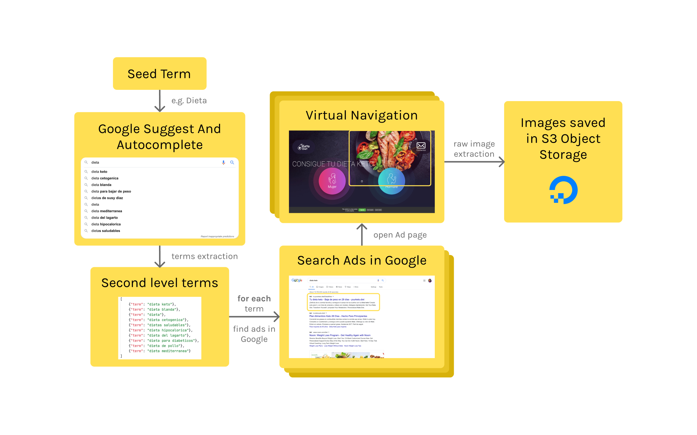

# Eyetracking Project

This program is an unofficial "google suggest" scraper to use with a study related to eating disorders.

## Scraper Algorithm

The following image describe the steps to obtain a lot of raw images from seed ("diet" in this case).

  

